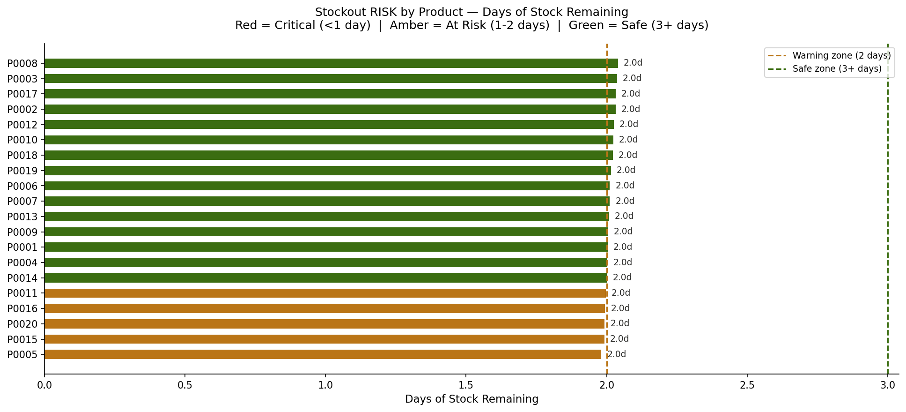
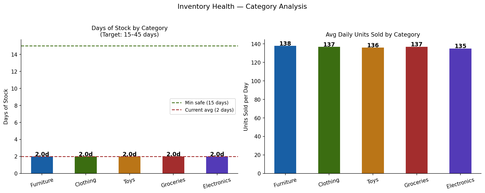
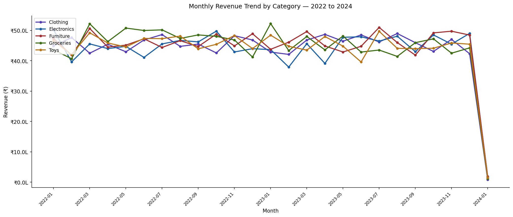
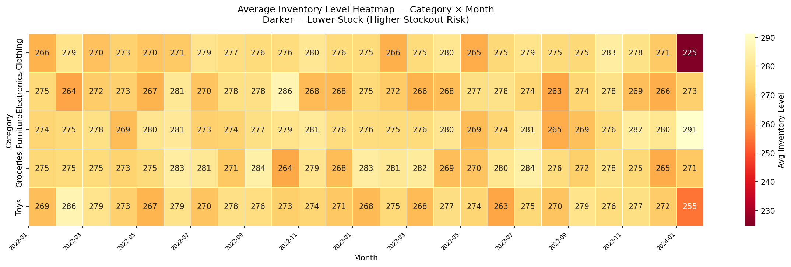
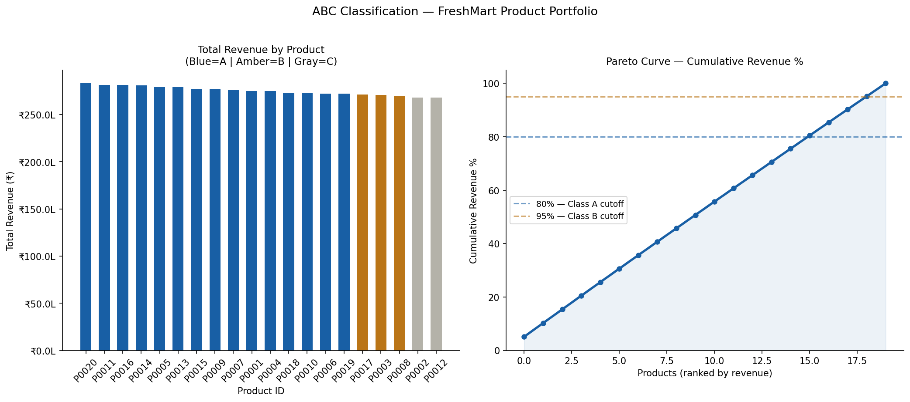
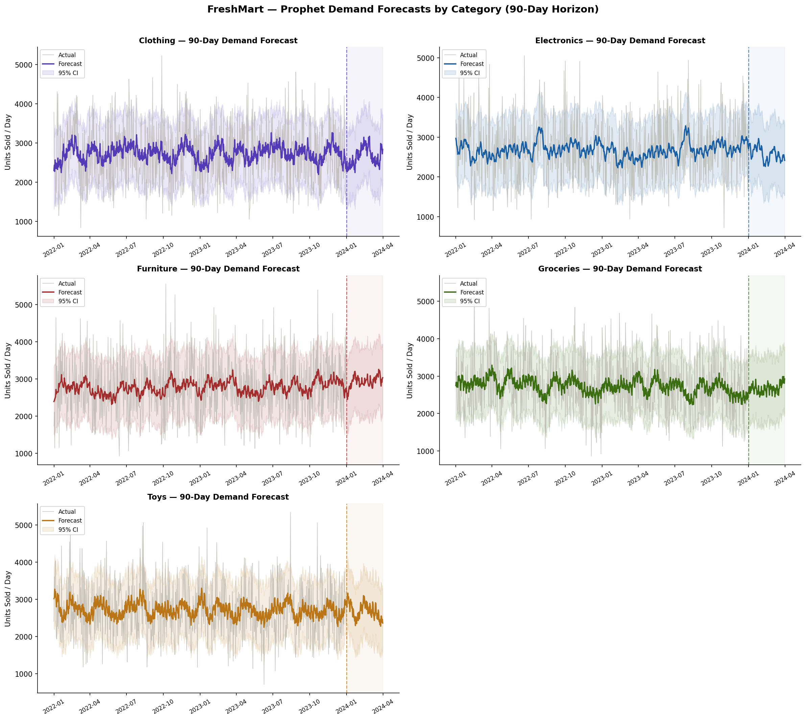
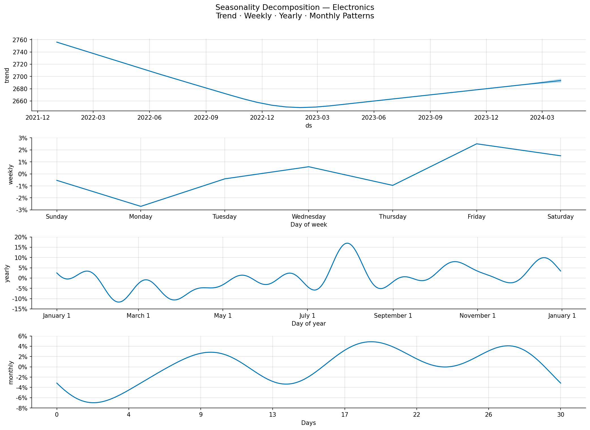
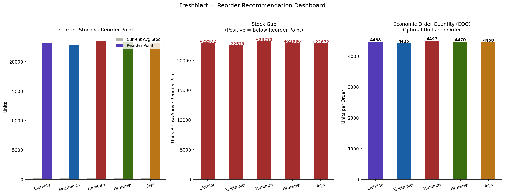

# 🛒 FreshMart Retail — Inventory Optimisation & Stockout Prevention

<div align="center">


**A complete end-to-end Business Analyst portfolio project**  
From business problem definition → SQL analysis → Python EDA → demand forecasting → executive Power BI dashboard

[📊 View Dashboard](#-power-bi-dashboard) · [🗂️ Project Structure](#-project-structure) · [▶️ How to Run](#-how-to-run) · [📋 Key Findings](#-key-findings)

</div>

---

## 📌 Business Problem

**FreshMart Retail Pvt. Ltd.** is a mid-sized retail chain operating **5 stores across India**, selling across 5 product categories: Electronics, Groceries, Clothing, Toys, and Furniture.

The Operations Director flagged a critical inventory crisis:

| Pain Point | Impact |
|---|---|
| 18–22% of SKUs going out of stock during peak months | ₹35–40L in estimated lost monthly revenue |
| 15% of SKUs chronically overstocked | Working capital unnecessarily tied up |
| Fully manual reorder process | No automated triggers or alerts |
| Zero real-time inventory visibility | Leadership flying blind on stock health |

> **My Role:** Business Analyst — tasked to identify stockout risk, build demand forecasting, design a reorder engine, and deliver an executive dashboard for weekly operations monitoring.

---

## 🎯 BA Mandate & KPI Framework

### Objectives Defined Upfront
1. Identify products at highest stockout and overstock risk
2. Perform root cause analysis on inventory failures using historical data
3. Build a demand forecasting model to predict future inventory needs
4. Design an automated reorder recommendation engine with reorder points
5. Deliver a 4-page executive Power BI dashboard for weekly ops monitoring

### KPIs Defined Before Any Analysis
| KPI | Definition | Target |
|---|---|---|
| Stockout Rate | % of SKUs with zero stock on any given day | < 5% |
| Days of Stock | Current stock ÷ Average daily demand | 15–45 days |
| Inventory Turnover | Units sold ÷ Average inventory level | > 6× per year |
| Fill Rate | % of demand met without stockout | > 95% |
| Reorder Accuracy | % of reorders placed within optimal window | > 90% |
| Overstock Rate | % of SKUs with stock > 2× monthly demand | < 10% |

---
---

## 🔑 Key Findings

> ⚠️ **Critical Finding:** All 100 product-category combinations are operating with only **2 days of stock buffer** — 87% below the 15-day industry safe minimum — against a 7-day supplier lead time.

| Finding | Detail |
|---|---|
| **100% products understocked** | Every product classified UNDERSTOCKED vs monthly demand |
| **2 days of stock (all categories)** | Target is 15–45 days — currently 87% below minimum |
| **₹4.5M+ at risk monthly** | Revenue at risk across full portfolio if no reorder action |
| **15 Class A products** | Drive 75.52% of total revenue (Pareto 80/20 confirmed) |
| **6× stock gap** | Current stock ~270 units vs safe reorder point ~1,600 units |
| **Systemic, not isolated** | All 5 stores equally affected — policy fix required |

---

---

---

## 📈 Analysis Charts

### Stockout Risk by Product


### Inventory Health by Category


### Monthly Revenue Trend 2022–2024


### Inventory Level Heatmap — Category × Month


### ABC Classification — Pareto Analysis


### Prophet Demand Forecasts — 90-Day Horizon


### Seasonality Decomposition — Electronics


### Reorder Recommendation Dashboard


---

## 🏗️ Project Architecture

This project follows the **Medallion Architecture** pattern used in enterprise data platforms:

```
freshmart-inventory-optimisation/
│
├── 🟤 BRONZE LAYER (Raw Data)
│   └── data/raw/
│       └── retail_store_inventory.csv        ← Kaggle dataset (73,100 rows)
│
├── ⚪ SILVER LAYER (Cleaned & Structured)
│   └── data/processed/
│       ├── freshmart.db                      ← SQLite database (6 tables)
│       └── freshmart_clean.csv               ← Cleaned dataset
│
├── 🟡 GOLD LAYER (Business Outputs)
│   └── data/output/
│       ├── chart1_stockout_risk.png
│       ├── chart2_inventory_health.png
│       ├── chart3_revenue_trend.png
│       ├── chart4_inventory_heatmap.png
│       ├── chart5_abc_classification.png
│       ├── chart6_demand_forecasts.png
│       ├── chart7_seasonality.png
│       ├── chart8_reorder_dashboard.png
│       ├── abc_classification.csv
│       ├── freshmart_reorder_recommendations.xlsx
│       └── freshmart_master_reorder_report.xlsx
│
├── 💎 INSIGHT LAYER (Presentation)
│   └── powerbi/
│       └── freshmart_dashboard.pbix          ← 4-page Power BI dashboard
│
├── 📓 NOTEBOOKS
│   ├── notebooks/01_data_exploration.ipynb   ← Phase 1: Data setup & schema
│   ├── notebooks/02_eda_analysis.ipynb       ← Phase 2: SQL + EDA + ABC
│   ├── notebooks/03_forecasting.ipynb        ← Phase 3: Prophet forecasting
│   └── notebooks/04_reorder_engine.ipynb     ← Phase 3: Reorder engine & EOQ
│
├── 🗄️ SQL
│   ├── sql/01_schema_setup.sql               ← 5-table database schema
│   ├── sql/02_inventory_analysis.sql         ← Inventory KPI queries
│   └── sql/03_kpi_queries.sql                ← Business KPI queries
│
├── 📄 REPORTS
│   ├── reports/phase1_summary.pdf
│   └── reports/phase2_summary.pdf
│
├── README.md
└── requirements.txt
```

---

## 🗄️ Database Schema

5-table relational schema designed in SQLite:

```sql
products            → product_id · category · unit_price · supplier_id
inventory           → product_id · warehouse_id · stock_quantity · reorder_point
sales_transactions  → transaction_id · product_id · sale_date · qty_sold · amount
suppliers           → supplier_id · lead_time_days · reliability_score
warehouses          → warehouse_id · location_city · capacity
```

---

## 📐 Analytical Methods

### 1. SQL Analysis (5 Queries)
| Query | Business Question | Technique |
|---|---|---|
| Stockout Rate | Which products are most at risk? | CASE WHEN, GROUP BY, COUNT |
| Inventory Turnover | How efficiently is inventory managed? | SUM/AVG, NULLIF, ORDER BY |
| Overstock Detection | Which products need immediate reorder? | Nested CASE WHEN, aggregations |
| Store-Level Analysis | Are certain stores worse than others? | Multi-column GROUP BY |
| Monthly Trend | What are seasonal demand patterns? | strftime(), time aggregation |

### 2. ABC / Pareto Classification
- Class A: Top 80% revenue products → **Priority inventory management**
- Class B: Next 15% revenue products → **Moderate monitoring**
- Class C: Bottom 5% revenue products → **Routine management**
- Result: 15 Class A products drive **75.52%** of total revenue

### 3. Demand Forecasting — Facebook Prophet
```python
Prophet(
    seasonality_mode='multiplicative',
    yearly_seasonality=True,
    weekly_seasonality=True,
    changepoint_prior_scale=0.05,
    seasonality_prior_scale=10
)
# Custom monthly seasonality added (fourier_order=5)
# 5 models trained — one per product category
# Forecast horizon: 90 days
```

### 4. Reorder Engine — Formulas
```
Reorder Point  = (Avg Daily Demand × Lead Time Days) + Safety Stock
Safety Stock   = Avg Daily Demand × Safety Stock Days (5)
EOQ            = √(2 × Annual Demand × Ordering Cost / Holding Cost)
Days of Stock  = Avg Inventory Level ÷ Avg Daily Demand
```

**Results:**
- Reorder Point: ~1,600 units per category
- Economic Order Quantity: ~4,400–4,500 units per order
- Current Days of Stock: 2 days (Target: 15–45 days)

---

## 💡 Business Recommendations

| Priority | Timeframe | Action | Expected Impact |
|---|---|---|---|
| 🔴 IMMEDIATE | This week | Emergency reorder — all 20 products at EOQ quantities. Start with Class A. | Eliminates stockout risk within 7 days |
| 🟠 SHORT TERM | 30 days | Implement automated reorder alerts in Power BI when stock drops below ROP | Saves 15+ hours ops time weekly |
| 🟡 MEDIUM TERM | 90 days | Rebuild safety stock to 15-day minimum. Renegotiate supplier lead times. | Reduces stockout risk by ~90% |
| 🟢 STRATEGIC | 6 months | Refresh Prophet models monthly. Build seasonal pre-order calendar. | Forecast accuracy maintained >85% |

---

## ▶️ How to Run

### Prerequisites
- Python 3.12+
- Power BI Desktop (for dashboard)
- Git

### Setup

**1. Clone the repository**
```bash
git clone https://github.com/nandini2217/freshmart-inventory-optimisation.git
cd freshmart-inventory-optimisation
```

**2. Create and activate virtual environment**
```bash
python -m venv venv

# Windows
venv\Scripts\activate

# Mac/Linux
source venv/bin/activate
```

**3. Install dependencies**
```bash
pip install -r requirements.txt
```

**4. Add the dataset**
- Download `retail_store_inventory.csv` from [Kaggle](https://www.kaggle.com/datasets/anirudhchauhan/retail-store-inventory-forecasting-dataset)
- Place it in `data/raw/`

**5. Run notebooks in order**
```bash
jupyter notebook
```
Run: `01_data_exploration.ipynb` → `02_eda_analysis.ipynb` → `03_forecasting.ipynb` → `04_reorder_engine.ipynb`

**6. Open Power BI Dashboard**
- Open `powerbi/freshmart.pbix` in Power BI Desktop
- Refresh data connections if prompted

---

## 🛠️ Tech Stack

| Category | Tools |
|---|---|
| Language | Python 3.12 |
| Data Manipulation | Pandas, NumPy |
| Visualisation | Matplotlib, Seaborn, Plotly |
| Forecasting | Facebook Prophet |
| Database | SQLite (via sqlite3 + SQLAlchemy) |
| BI Dashboard | Power BI Desktop (DAX, Data Modelling) |
| Excel Export | openpyxl, xlsxwriter |
| Environment | VS Code, Jupyter Notebook |
| Version Control | Git, GitHub |

---

## 📦 Dataset

| Detail | Value |
|---|---|
| Source | [Kaggle — Retail Store Inventory Forecasting](https://www.kaggle.com/datasets/anirudhchauhan/retail-store-inventory-forecasting-dataset) |
| Records | 73,100 rows |
| Columns | 15 |
| Date Range | January 2022 – January 2024 |
| Stores | 5 |
| Products | 20 unique SKUs |
| Categories | Electronics, Groceries, Clothing, Toys, Furniture |
| Missing Values | Zero |

---

## 👩‍💼 About

**Nandini Katta** — Business Analyst  
Python · SQL · Power BI · Prophet · Databricks · AWS

📧 nandinikatta35@gmail.com  
🔗 [LinkedIn](https://linkedin.com/in/nandini-k-76470a395)  
💻 [GitHub](https://github.com/nandini2217)

---


<div align="center">


</div>